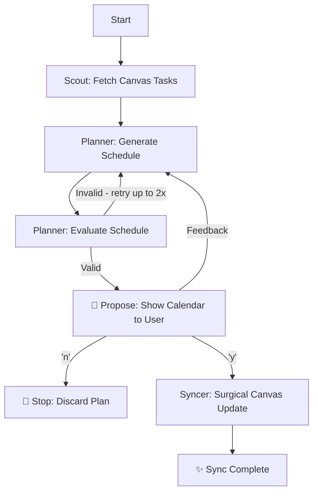

# 🐴 Homework-Horse
> Homework-Horse is a multi-agent study system built with CrewAI. It transforms a chaotic list of Canvas assignments into a high-performance study schedule. Homework-Horse bridges the gap between "I have an assignment" and "When am I actually going to do it?" It respects your sleep, avoids burnout, and writes directly to your Canvas calendar.

## Prerequisites

### Canvas Setup
1. Log in to Canvas and go to **Account → Settings**
2. Scroll to **Approved Integrations** and generate a new access token
3. Fill in the required fields and save the token

### Hugging Face Setup
1. Go to `https://huggingface.co/settings/tokens`
2. Create a new token with **Inference** permissions

### Python Setup
Ensure Python >=3.10 is installed, then run:
```bash
pip install crewai canvasapi python-dotenv
```

---

## Environment Variables

Create a `.env` file in the project root:

```env
CANVAS_API_URL=https://your-institution.instructure.com
CANVAS_API_KEY=your_canvas_token_here
HUGGINGFACEHUB_API_TOKEN=your_hf_token_here
```

---

## Running the App

```bash
python3 main.py
```

Once complete, check your **Canvas Calendar** to review the changes. To view execution traces, visit [app.crewai.com](https://app.crewai.com) after running `crewai login`.

---

## 🛠 Project Architecture

The system is split into modular components across a multi-agent crew:

- **`main.py`**: Entry point. Runs the planning crew, handles human-in-the-loop confirmation, then triggers the sync crew.
- **`crew.py`**: Defines the three agents, their tasks, and the two-phase crew configuration.
- **`tools_crew.py`**: Wraps the core tool functions as CrewAI-compatible `@tool` decorated functions.
- **`tools.py`**: Contains the underlying tool implementations (Canvas API calls, scheduling logic, sync engine).
- **`evaluation.py`**: Standalone test suite to validate scheduling logic without running the full crew.

---

## 🤖 Agents

| Agent | Role | Responsibility |
| :--- | :--- | :--- |
| **Canvas Scout** | Observation | Connects to Canvas and retrieves assignment titles and deadlines within a 7-day rolling window. |
| **Study Planner** | Planning + Criticism | Generates a burnout-aware schedule, evaluates it, and retries with adjusted parameters if invalid (max 2 retries). |
| **Calendar Syncer** | Action | Performs a surgical sync — uses fingerprinting to only add or delete what is necessary, leaving existing events untouched. |

---

## 🛠 Tools

| Tool | Capability | Purpose |
| :--- | :--- | :--- |
| **`fetch_canvas_tasks`** | **Observation** | Connects to the Canvas API to retrieve assignment titles and deadlines within a rolling window. |
| **`generate_smart_schedule`** | **Planning** | A heuristic engine that maps tasks to time blocks while respecting sleep windows and "Blackout Dates." |
| **`evaluate_schedule`** | **Criticism** | Analyzes a proposed plan for two failure states: **Burnout** (daily load > 6h) and **Deadline Violations**. |
| **`sync_study_blocks`** | **Action** | Performs a "Surgical Sync." It uses fingerprinting to ensure it only adds or deletes what is necessary, leaving existing events untouched. |

---

## 🔄 The Workflow



The crew runs in **two phases** to preserve the human confirmation gate:

1. **Phase 1** — Scout + Planner run sequentially and present the final calendar.
2. **Phase 2** — After the user confirms with `y`, the Syncer runs and pushes blocks to Canvas.

---

## 🧪 Evaluation

Run the standalone test suite to validate scheduling logic:

```bash
python3 evaluation.py
```

| Case | What It Tests |
| :--- | :--- |
| Case 1: Baseline | Happy path — tasks scheduled correctly with no conflicts |
| Case 2: Burnout Detection | 10-hour task triggers `valid: false` |
| Case 3: Blackout Respect | No blocks placed on a blacked-out date |
| Case 4: Deadline Enforcement | Session past deadline triggers a warning |
| Case 5: Fingerprint Sync | Canvas `Z`-suffix normalization produces matching fingerprints |

---

## 📡 Tracing

Enable execution tracing to view agent decision steps, tool calls, and token usage in the CrewAI AMP dashboard.

**Step 1** — Log in and enable tracing globally via the CLI:

```bash
crewai login      
crewai traces enable
```

**Step 2** — Run the app. At the end of each crew execution, a trace link is printed directly in the terminal:

```
✅ Trace batch finalized with session ID
🔗 View here: https://app.crewai.com/crewai_plus/trace_batches/<session_id>
```

Click the link or go to [app.crewai.com](https://app.crewai.com) to view the full trace.